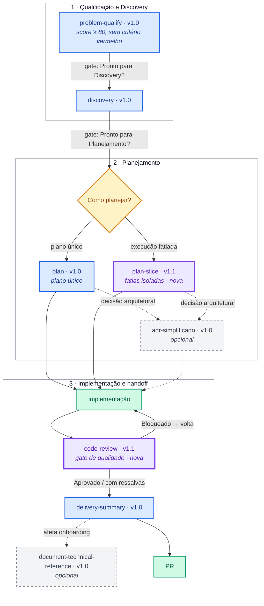

# Skills de metodologia

Pacote de [Agent Skills](https://cursor.com/docs/context/skills) para o Cursor. Cada skill padroniza uma etapa do ciclo de uma demanda de software — da qualidade da entrada até o handoff da entrega — com artefatos em Markdown, gates explícitos e restrições do que o agente **não** deve fazer.

Todas as skills estão em [`skills/cursor/`](skills/cursor/) e usam `disable-model-invocation: true`: o agente só as aplica quando você as chama (por nome ou pelo gatilho descrito em cada uma).

O contexto e os princípios por trás desse pacote estão no artigo [Engenharia Aumentada](docs/artigos/engenharia-aumentada.md) (rascunho da **v1.0**). O pacote de skills está na **v1.1** — ver [Changelog](#changelog).

## Fluxo

**Legenda:** azul = skill **v1.0** · roxo = skill **v1.1** (nova) · amarelo = decisão / gate · verde = implementação / entrega · cinza tracejado = opcional

A ordem é a do ciclo de trabalho. Setas pontilhadas disparam só quando o contexto pede.

| Etapa | Skill | Desde | Artefato | Persistência |
|-------|--------|-------|----------|--------------|
| Qualificar o card | [`problem-qualify`](skills/cursor/problem-qualify/SKILL.md) | v1.0 | Score 0–100 + lacunas / contexto para Discovery | Só no chat |
| Discovery | [`discovery`](skills/cursor/discovery/SKILL.md) | v1.0 | Documento de Discovery | Chat; arquivo em `docs/discovery/` se pronto para planejamento |
| Plano técnico | [`plan`](skills/cursor/plan/SKILL.md) | v1.0 | Plano de implementação | Só no chat |
| Plano fatiado | [`plan-slice`](skills/cursor/plan-slice/SKILL.md) | **v1.1** | Plano em fatias de execução isoladas | Só no chat |
| Decisão de arquitetura | [`adr-simplificado`](skills/cursor/adr-simplificado/SKILL.md) | v1.0 | ADR | `docs/adr/` |
| Code review | [`code-review`](skills/cursor/code-review/SKILL.md) | **v1.1** | Parecer com severidade + veredicto | Só no chat |
| Referência técnica | [`document-technical-reference`](skills/cursor/document-technical-reference/SKILL.md) | v1.0 | Tópicos de onboarding | `docs/references/` |
| Handoff da entrega | [`delivery-summary`](skills/cursor/delivery-summary/SKILL.md) | v1.0 | Corpo do PR + resumo de negócio | Só no chat |

## Changelog

### v1.1

Novas skills no fluxo (ainda não descritas no [artigo v1.0](docs/artigos/engenharia-aumentada.md)):

- **`plan-slice`** — plano técnico fatiado em unidades de execução isoladas (alternativa/complemento ao `plan`).
- **`code-review`** — gate de qualidade entre implementação e `delivery-summary`.

### v1.0

Skills cobertas pelo artigo [Engenharia Aumentada](docs/artigos/engenharia-aumentada.md):

- `problem-qualify`
- `discovery`
- `plan`
- `adr-simplificado`
- `delivery-summary`
- `document-technical-reference`

Workflow narrado na v1.0: **Qualificar → Descobrir → Planejar → Implementar → Entregar → Preservar conhecimento**.

---

## Skills

### [`problem-qualify`](skills/cursor/problem-qualify/SKILL.md)

Qualifica a qualidade de entrada de um card ou demanda **antes** do Discovery.

- Mede nove critérios (contexto, impacto, evidências, sucesso, escopo, stakeholders, segurança, testes, estratégia de entrega) e gera um **score 0–100**.
- Entrevista o PM nas lacunas; não inventa evidências, impacto nem riscos.
- **Gate:** Pronto para Discovery somente com score ≥ 80 e nenhum critério vermelho.
- Quando o gate passa, sugere chamar `discovery` com o contexto organizado.

**Quando usar:** “qualifica este card”, “esta demanda está pronta para Discovery?”, refinamento com PM.

### [`discovery`](skills/cursor/discovery/SKILL.md)

Transforma uma demanda em um Discovery estruturado **antes** do planejamento técnico.

- Cobre resumo, objetivo, escopo (dentro/fora), premissas, segurança, dúvidas e lacunas.
- Faz triagem de feature flag e de considerações de segurança quando a informação não vier na entrada.
- **Não** sugere arquitetura, plano, código, ADR nem estimativa.
- Salva em `docs/discovery/NNNN-titulo-curto.md` só se estiver pronto para planejamento (ou se você pedir).

**Quando usar:** discovery, levantamento inicial, escopo de demanda, refinamento de requisito.

### [`plan`](skills/cursor/plan/SKILL.md)

Gera o planejamento técnico da atividade, só no chat.

- Objetivo, estratégia, caminho escolhido, segurança, ordem de implementação, rollout, testes, observabilidade e pendências.
- Confronta decisões em aberto do Discovery **antes** do plano final.
- Triagem de testes: pergunta se a atividade deve conter testes e não inventa a resposta.
- Alinha o caminho ao `QUICK_START_GUIDE` do projeto, quando existir.
- Se surgir decisão arquitetural, sugere `adr-simplificado` em vez de registrar o ADR ela mesma.

**Quando usar:** plano técnico, planejamento de implementação, transformar Discovery em plano de execução.

### [`plan-slice`](skills/cursor/plan-slice/SKILL.md)

Gera um plano técnico fatiado em unidades de execução isoladas, só no chat. Não substitui `plan`: use `plan` para um plano único; use esta skill para fatiar a execução.

- Cada fatia é um brief auto-contido (escopo, fronteira, contrato de saída, testes da fatia, critério de pronto) para o próximo agente implementar isolado.
- Entrega cada fatia num fence Markdown copiável **ou** no passo de execução (pedir a próxima fatia pendente).
- Só fatia quando houver fronteira real; demanda pequena vira **Fatia única**, com o mesmo template.
- Confronta decisões em aberto e faz triagem de testes **antes** do plano final.
- Restrições globais de segurança, rollout e observabilidade entram no plano-pai e se repetem só o necessário em cada fatia.
- **Não** persiste arquivo, não escreve código e não cria ticket, branch ou PR.

**Quando usar:** plan-slice, plano fatiado, fatias de execução, escopo isolado para o agente, transformar Discovery em plano executável uma fatia por vez.

### [`adr-simplificado`](skills/cursor/adr-simplificado/SKILL.md)

Registra decisões de arquitetura em ADR curto e objetivo.

- Triagem prévia: só cria ADR se a decisão alterar arquitetura, tiver impacto futuro, trade-offs ou for difícil de reverter.
- Estrutura: contexto, opções, decisão, justificativa, consequências (benefícios, riscos, débitos).
- Grava em `docs/adr/NNNN-titulo-curto.md`. Não sobrescreve ADRs existentes.

**Quando usar:** ADR, registro de decisão de arquitetura, trade-offs, padrões, integrações ou escolha tecnológica de longo prazo.

### [`document-technical-reference`](skills/cursor/document-technical-reference/SKILL.md)

Cria ou revisa documentação de referência técnica para onboarding.

- Um tópico por assunto: para que serve, como funciona, como rodar na mão.
- Documenta **somente** o que você indicar (arquivo, pasta, comando, classe, fluxo).
- Destino típico: `docs/references/`. Quando fizer sentido, o README do projeto deve linkar direto para o arquivo.

**Quando usar:** documentar, atualizar ou revisar uma referência a partir de um caminho ou símbolo do projeto.

### [`code-review`](skills/cursor/code-review/SKILL.md)

Revisa a implementação **antes** do `delivery-summary`, como gate do pipeline de entrega.

- Checklist dual-layer (universal + contextual), cruzando com Discovery/Plan quando existirem.
- Classifica achados por severidade: BLOQUEADOR / AVISO / SUGESTÃO.
- Veredicto: **Aprovado** / **Aprovado com ressalvas** / **Bloqueado**.
- **Não** reescreve código, não commita e não gera corpo de PR.
- Inclui referência de anti-padrões em `anti-patterns.md`.

**Quando usar:** code review, revisão de código, validar mudanças antes do PR.

### [`delivery-summary`](skills/cursor/delivery-summary/SKILL.md)

Depois da implementação, monta o texto do PR (fácil de copiar) e um resumo de negócio para Slack, e-mail ou card.

- Triagem de idioma (português ou inglês) e de links (card / documentos).
- Bloco A: corpo do PR (`Summary`, `Contexto`/`Context`, `Test plan`, `Related`).
- Bloco B: o que foi entregue, por que importa, o que muda na prática; segurança e observabilidade só quando forem reais na entrega.
- **Não** abre PR no GitHub. Se a mudança afetar onboarding, sugere `document-technical-reference`.

**Quando usar:** descrição de PR, handoff de entrega, resumo para negócio, comunicação pós-implementação.

---

## Como usar no Cursor

1. Copie a pasta `skills/cursor/` para `.cursor/skills/` do projeto (ou para o diretório de skills do usuário).
2. Chame a skill pelo nome ou pelo gatilho da descrição — por exemplo: “roda o `problem-qualify` neste card”.
3. Siga o fluxo da tabela acima. Não pule o gate: `discovery` espera qualificação pronta; `plan` espera Discovery pronto (ou contexto equivalente).

Cada `SKILL.md` é a fonte da verdade: responsabilidades, restrições, fluxo e template de saída estão lá.
